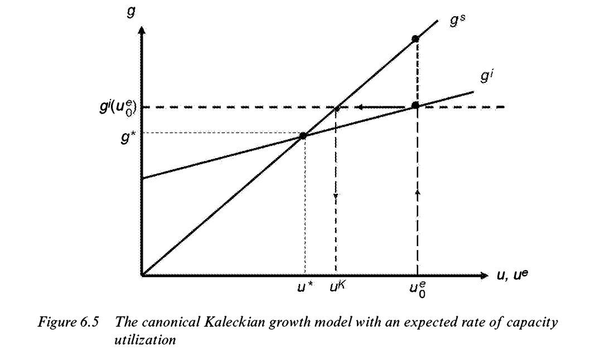

Lavoie, M., & Lavoie, M. (2014). *Post-Keynesian economics: New foundations*.

### Chapter 6: Accumulation and capacity

"[O]ne of the objectives of post-Keynesian theory is to combine the classical concerns for growth and distribution with the Keynesian principle of effective demand."

##### 6.1 The neo-Keynesian model: the inflationist version

<u>Neo-Keynesian models of growth</u>: "developed by Robinson, Kaldor and Pasinetti in the late 1950s and in the early 1960s" with contributions from "more than 200 scholars".

- <u>Kaleckian models of growth</u>: "associated with the Kaleckian foundations".
- Differences:
  1. Neo-Keynesian models "are basically set in a world of competition". Kaleckian models "are part of an oligopolistic framework".
  2. Neo-Keynesian models "implicitly assume that in the long period the rate of utilization of capacity is fixed at its normal level". In Kaleckian models "the rate of utilization is presumed to be endogenous, even in the long period".

###### 6.1.1 The stability of the model

In the neo-Keynesian model: "the rate of profit does not depend on microeconomic technical conditions or on relative physical endowments, but solely on macroeconomic variable":

- "the rate of growth of the economy and some variable related to the propensity to save out of profits".
- Under the Pasinetti assumption (than wages can also be saved): "it s the propensity to save on profits by the capitalist class that determines the rate of profit".

- Classical saving assumption: $I = s_p P \quad (6.1)$:

  - The Cambridge equation: "Dividing both sides of equation $(6.1)$ by $K$, the stock of capital, and rearranging, one gets the overall rate of profit $r$ as a function of the overall rate of accumulation $g$ and of the propensity to save on profits": $r = \displaystyle\frac{g}{s_p} \quad (6.2)$ .

  - "Although simple, the Cambridge equation raises several controversial issues":

    - "In its standard interpretation [...], it is the rate of growth that determines the rate of profit."
      - Stems from "the short-run Keynesian scheme, where investment is given and hence considered the exogenous variable."
      - "Conversely, a number of heterodox economists, mainly Marxians, believe that an exogenous rate of profit determines the rate of growth".
      - "<u>[B]oth variables may be seen as being endogenously determined</u>".
    - Rewriting $(6.2)$ and "denoting it as $g^s$ to indicate that it describes the rate of growth of the supply of savings": $g^s = s_p r$ .

  - "One simple way to have both variables endogenous, while preserving the one-way causality from output variables (the rate of investment) to price variables (the rate of profit), is to keep equation $(6.2)$ while making the rate of growth decided by the entrepreneurs a function of the expected rate of profit on future investment".

    - "Calling $r^e$ the expected rate of profit, and $\gamma$ the rate of growth if no profit were expected, we have the investment function in a dynamic mode": $g^i = \gamma + \gamma_r r^e \quad(6.4)$ .

    - "Both coefficients $\gamma$ and $\gamma_i$ may be said to reflect the animal spirits of the entrepreneurs."

      - "[T]the $\gamma_r$ parameter reflects  the sensitivity of the rate of growth decided by the entrepreneurs to changes in the expected rate of profit."

    - "For the model to be complete, we thus need one more equation that relates the expected rate of profit at time $t$ to the actual rate of profit at time $t_{-1}$" : $r^e_t = (1-\phi) r^e_{t-1} + \phi r_{t-1}, \textrm{ with } 0 < \phi < 1 \quad (6.5)$

      - "When the actual rate of profit at period $t_{-1}$ is equal to the expected rate of profit of the same period, there is no change in the expected rate. We may then speak of an equilibrium rate of profit."

    - "The rate of growth $g^{*}$ that corresponds to this value of the [equilibrium] rate of profit [...] is called by Robinson the desired rate of growth."

      - "This rate of growth is such that the expectations of the entrepreneurs are fulfilled."

    - "Equations $(6.3)$ and $(6.4)$ thus jointly determine an endogenous rate of accumulation and an endogenous rate of profit, assuming that in the long-run equilibrium the expected and the realized rates of profit are identical."

      - "The desired rate of growth is thus equal to": $g^{*} = \displaystyle\frac{s_p \gamma}{(s_p - \gamma_r)} \quad (6.6)$ 

        "while the equilibrium rate of profit, such that $r=r^e$, given by": $r^{*} = \displaystyle\frac{\gamma}{(s_p - \gamma_r)} \quad (6.7)$

        * "For the Robinsonian model of growth to be stable, we thus need the following inequality": $\boldsymbol\gamma_\boldsymbol r \boldsymbol< \boldsymbol s_\boldsymbol p \quad (6.8)$

###### 6.1.2 The Paradox of Thrift and Constant Normal Rates of Utilization

"One of the major features of the neo-Keynesian model is that it transposes Keynes's [paradox of thrift](https://en.wikipedia.org/wiki/Paradox_of_thrift) to the long period."

- "[A]ny increase in the propensity to save leads to a reduction in the level of output or of employment."
- "In the simple neo-Keynesian model of growth and distribution presented here, an increase in the propensity to save on profits leads to a reduction in the desired rate of growth and in the equilibrium rate of profit."
  - For the profit rate: $\displaystyle\frac{d}{d s_p} r^{*} = -\displaystyle\frac{\gamma_r}{(s_p - \gamma_r)^2} < 0$ .
  - For the growth rate: $\displaystyle\frac{d}{ds_p} g^{*} = -\displaystyle\frac{\color{red}\gamma^2_r\color{black}}{(s_p - \gamma_r)^2} < 0 \quad (6.9)$ .

"[N]ormal capacity must be understood as the sum of all the practical capacities, that is, the full capacity of a firm".

- "There are substantial consequences to the assumption that the rate of utilization of capacity across long-run positions is a constant (here equal to unity)."
  1. "[C]hanges in the distribution of income can occur only through changes in the price level relative to wages, that is, in the mark-up on unit costs."
     - "A higher level of demand, that is, a higher rate of growth, is absorbed by higher prices."
     - "This is why the neo-Keynesian model is called an 'inflationist' theory of growth".
- "The profit rate can be expressed as the product of three ratios: the profit to output ratio, which is the share of profit $\pi$; the output to full-capacity output ratio, which is the rate of utilization $u$; and the inverse of the capital to full-capacity output ratio, which we called $v$ ".
  - "This is often referred to as Weisskopf's decomposition of the profit rate": $r = \bigg(\displaystyle\frac{P}{q}\bigg) \bigg(\displaystyle\frac{q}{q_{fc}}\bigg) \bigg(\displaystyle\frac{q_{fc}}{M}\bigg) = \displaystyle\frac{\pi u}{v} \quad (6.10)$ .

> "Thus, within this framework, it is not the abstinence of the capitalists that allows for faster growth; rather it is the sacrifices of the workers, through their lower real income. [W]e will refer to such a negative relationship between growth and real wages as a profit-led growth regime."

###### 6.1.3 The Inflation Barrier

"The second consequence of assuming full-output capacity or a continuous normal rate of utilization is that the paradox of thrift may not hold after all."

- "There exists a post-Keynesian tradition according to which more thriftiness leads to a faster accumulation".
  - "This tradition is associated with Joan Robinson's 'inflation barrier', which turns upside down the causality associated with the Cambridge equation, bringing forth a closely resembling Marxian view of accumulation and income distribution".

"[T]he national revenue  can be written as the sum of wages and profits on capital": $pq = wL + rpM \quad (1.4)$

- "This can be rewritten as": $p = w \displaystyle\frac{L}{q} + rp \displaystyle\frac{M}{q}$ .
- "Within the framework imposed by Kaldor and Robinson on long-period analysis, there is no overhead labour, so that output per unit of labour $\displaystyle\frac{q}{L}$ is a constant equal to $y$."
- "Further more, [...] the rate of utilization of capacity is assumed to be equal to its normal or standard rate (or unity), so that the capital output ratio $\displaystyle\frac{M}{q}$ is another constant, equal to $\displaystyle\frac{v}{u_n}$".
  - "[E]quation $(1.4)$ may thus be rewritten as": $p = \displaystyle\frac{w}{y} \displaystyle\frac{1}{\bigg(1-r\displaystyle\frac{v}{u_n}\bigg)}$ .
  - "Rearranging the above equation, one gets the inverse relationship between the real wage rate and the rate of profit, the <u>wage-profit frontier</u>": $\displaystyle\frac{w}{p} = y \bigg(1 - r \displaystyle\frac{v}{u_n}\bigg) \quad (6.11)$

"We are now ready to explain Robinson's inflation barrier."

- "[A] higher rate of growth causes a higher rate of profit, which itself induces a lower real wage rate because of equation $(6.11)$, given [...] a fixed rate of utilization".
- "The inflation barrier also requires the reasonable hypothesis that workers refuse to have their real wages squeezed out by a higher rate of profit, induced by a faster rate of growth".
- "There is then a minimum acceptable real wage rate".
  - "If this minimum wage rate is reached, the neo-Keynesian model turns into a Marxian model, where the real wage rate is given and determines the other variables of the system".
  - "The conflict between the growth objectives of the firms and the minimum standards of living of the workers cannot be resolved, and inflation sets in".
  - "When this happens, [...] monetary authorities raise interest rates until the animal spirits of the entrepreneurs are dampened and investment is curtailed".
  - "At that point, inflation pressures are eliminated".
- "The inflation barrier and its detrimental consequences on accumulation could have been avoided, however, if the propensity to save had been higher".
- "The standard Keynesian causal sequence is thus reversed."
  - "The rate of investment depends on the height of the acceptable real wage rate and on the degree of thriftiness".
  - "The higher the propensity to save, the higher the rate of accumulation".
- "When there is a real wage resistance on the part of the workers, a higher propensity to save on profits is favourable to the economy since it allows a higher rate of growth at a given rate of profit, that is, at a given real wage rate".
  - "When the inflation barrier has been reached, higher thriftiness generates a higher rate of accumulation by avoiding monetary restraints".

"By contrast  with the earlier neo-Keynesian models, the newer post-Keynesian models show no discrepancy between the behaviour of the economy in the short and in the long run".

- "They generally leave no room for thriftiness and austerity policies".

##### 6.2 The Kaleckian Growth Model

"The most intriguing result of [...] Kaleckian models is that higher costing margins, that is, lower real wages, lead to lower rates of utilization, lower growth rates and lower realized profit rates".

- "These results are 'the most important implication of the Kalecki-Steindl-Baran-Sweezy interpretation of contemporary capitalism'."

"There are four crucial aspects according to which the forthcoming model may be unambiguously called a Kaleckian model of growth and distribution".

1. "[T]here is the investment function, which may depend on several variables, one of which must be the rate of capacity utilization".
2. "[P]rices relative to direct costs are assumed to be given, dependent on conventional forces instead of market forces".
3. "[S]aving out of wages is often supposed to be nil, although it is sufficient to assume that the propensity to save out of wages is smaller than that out of profits".
4. "[T]he rate of utilization of capacity is assumed to be generally below unity, and labour is assumed not to be a constraint".

> "A considerable proportion of capital equipment lies idle in the slump. Even on average the degree of utilization throughout the business cycle will be substantially below the maximum reached during the boom. Fluctuations in the utilization of labour parallel those in the utilization of equipment... The reserve of capital equipment and the reserve army of the unemployed are typical features of capitalist economy at least throughout a considerable part of the cycle. (Kalecki, 1971, p. 137)"

###### 6.2.1 The Canonical Kaleckian Growth

"The model, in nearly all its variants, is made up of three equations that involve income distribution, saving and investment".

- "[W]e will assume away overhead labour costs for now, and hence the share of profits is a constant such that $\pi = \displaystyle\frac{\theta}{(1 + \theta)}$, where $\theta$ is the mark-up on unit direct costs".
- "The third equation is the new investment equation, which substitutes the rate of utilization for the profit rate of the Robinsonian investment equation $(6.4)$".

$$
\begin{align}
& r = \pi \displaystyle\frac{u}{v} & (6.10) \\
& g^s = s_p r & (6.3) \\
& g^i = \gamma + \gamma_u (u^e - u_n) & (6.12)
\end{align}
$$

- "As before, $\gamma$ is a parameter reflecting the animal spirits of firms".
- "The parameter $\gamma_u$ represents the sensitivity of the rate of accumulation to changes in the expected rate of utilization of capacity $u^e$, while $u_n$ is the normal or standard rate of utilization of capacity".
  - "The idea is that, if the actual or expected rate of utilization is higher than the normal rate, firms will speed up accumulation in an effort to bring back the actual rate towards the normal rate".

"One of the most contentious issues in economics is the way investment decisions are determined".

- "The first Kaleckian models of growth and distribution incorporated a slightly different investment function, which included both the rate of capacity utilization and the rate of profit": $g^i = \gamma + \gamma_u u + \gamma_r r \quad (6.13)$
  - "It turns out that the crucial results of the Kaleckian model of growth are obtained indifferently with either investment equations, $(6.12)$ or $(6.13)$".
    - "These equations reflect empirical work that has consistently shown that the most important explanatory variable of investment is the rate of capacity utilization (or sales) and cash flow (or profits)".
    - "Thus, whereas investment is driven by prices (the interest rate) in neoclassical economics, in post-Keynesian economics investment is essentially driven by quantities and finance".

"How can this little three-equation model be solved?"

- "[B]y incorporating equation $(6.10)$ into the saving equation, it can be rewritten as a linear equation of the rate of utilization, with the share of profits as one of the parameters": $g^s = s_p \pi \displaystyle\frac{u}{v} \quad (6.14)$

"We thus have two growth equations as a function of the rate of utilization".

- "These two equations are illustrated in Figure $6.5$".

- "They are drawn in such a way that th slope of the saving function is steeper that that of the investment function, as was the case in the neo-Keynesian model".
  - "This condition is what is called the Keynesian stability condition, which says that saving reacts more than investment to changes in the rate of utilization".
  - "With the specification of our two functions, this comes down to the inequality": $s_p \pi > v \gamma_u \quad (6.15)$
  - "The model reaches its long-run equilibrium when the two curves of Figure $6.5$ cross each other".
  - "When this occurs, expectations regarding the rate of utilization are realized; that is, when $u = u^e$, we obtain the equilibrium rate of utilization, and investment equals saving".
  - "We thus also obtain the equilibrium rate of growth and rate of profit of our little model."
    - "The rate of utilization is obtained by combining the investment and saving equation (*sic*) $(6.12)$ and $(6.14)$" : $u^{*} = \displaystyle\frac{(\gamma - \gamma_u u_n)v}{s_p \pi - v \gamma_u} \quad (6.16)$ 
    - "The denominator of this expression is the stability condition, for this solution to make sense, we need the rate of utilization to be positive, so that both the denominator and the numerator must be positive".
- "The issue of short-run instability can be seen in two ways".
  - "One possibility is to assume a disequilibrium mechanism, whereby the level of output is given in the ultra-short period."
    - "This means that in the ultra-short period the actual level of utilization is also assumed to be given, with $u = \bar u$".
    - "In general, there will be a discrepancy between desired investment and saving at this given level of output".
    - "Firms will then adjust the level of output to the disequilibrium observed in the goods market, and will thus increase output and hence the rate of capacity utilization whenever aggregate demand exceeds aggregate supply": $\displaystyle\frac{du}{dt} = \mu (g^i - g^s), \quad \mu > 0 \quad (6.17)$
  - "When the initial rate of utilization $u_0$ is too high relative to the equilibrium rate $u^{*}$, as shown in Figure $6.5$, saving at that rate of output is higher than investment, and, as a consequence, firms will reduce their rate of utilization of capacity".
    - "This will bring the economy towards $u^{*}$ <u>provided the saving curve is flatter than the investment curve</u>".
  - "Another way to see Keynesian instability is to imagine a pure adjustment process, assuming that firms are always able to adjust production to sales  within the period, thus assuming that the goods market is in equilibrium in each period".
    - "This is Duménil and Lévy call equilibrium dynamics".
    - "Firms make their investment decisions on the basis of the expected rate of capacity utilization $u^e$, which is set at the beginning of the period, but they have enough time to adjust production to the actual sales that occur, thus ensuring within each short period that aggregate supply equals aggregate demand, and hence that saving equals the investment expenditures that were activated on the basis of the expected rate of utilization".
      - "In other words, [...] we assume that firms are on their effective demand curve".
    - "The rate of utilization $u^k$ ($k$ for Keynesian or Kaleckian equilibrium) that will be realized in each short period will thus be given by equating equations $(6.12)$ and $(6.14)$, but this time without assuming $u = u^e $ " : $u^k = v \displaystyle\frac{\gamma + \gamma_u (u^e - u_n)}{s_p \pi} \quad (6.18)$
    - "We can envisage an adjusting mechanism, such that": $\displaystyle\frac{d u^e}{dt} = \mu_1 (u^k - u^e), \quad \mu_1 > 0 \quad (6.19)$
      - "With Keynesian stability, [...] this adjustment mechanism will bring the expected rate of utilization closer to the realized rate of utilization in the short period, and bring the economy towards the equilibrium utilization rate given by equation $(6.16)$".
      - "Note that this adjustment process is  no different from the adaptative process that we had assumed for the expected profit rate in the neo-Keynesian model, because equation $(6.19)$ can be rewritten as": $u^e_t = (1-\mu_1) u^e_{t-1} + \mu_1 u^k \quad(6.19A)$
    - "At this stage, we can make two remarks":
      1. "[F]rom now on, except when we deal once more with the issue of stability, we shall assume that either the economy has reached the short-period equilibrium utilization rate $u^k$ or that enough time has passed for the economy to reach the long-run equilibrium $u^{*}$ ".
      2. "[A]ll the adjustment is done through quantities, through the rate of utilization".

###### 6.2.2 Comparative Dynamics in the Canonical Kaleckian Model

"[I]n the Kaleckian model, the paradox of thrift holds, meaning that a higher propensity to save leads to a lower growth rate, and this will be accompanied by lower rates of profit and of capacity utilization".

- "In contrast to the neo-Keynesian model, all of this happens without any change in the costing margins or in real wages".

Paradox of costs: "[A] lower costing margin, that is, higher real wages in given technical conditions, leads to a higher realized profit rate".

- "Mathematically this can be shown by combining equation $(6.16)$ and equation $(6.10)$ ": $r^{*} = \displaystyle\frac{\gamma - \gamma_u u_n}{s_p - \gamma_u \displaystyle\frac{v}{\pi}} \quad (6.21)$
  - "Obviously, when the mark-up is higher, that is, when the share of profits $\pi$ is higher and real wages lower, the profit rate $r^{*}$ is lower".
  - "[R]eciprocally, when the sahre of profits $\pi$ is lower and real wages higher, the profit rate $r^{*}$ is higher".

"We have achieved what we believe to be the most puzzling result of the Kaleckian model of growth and distribution":

- "Higher labour costs, that is, higher real wages, are in the end conducive to higher profit rates".
  - "This is achieved because the higher real wages drive up consumption and hence rates of utilization, which induces faster rates of accumulation and thus higher profit rates".
  - "**[T]his is a typical example of macroeconomic paradox, where what is true for one entrepreneur is false for all of them taken together**".
    - "If a single firm raises real wages and reduces its costing margins, everything else being equal, it will obviously make less profit and it will face a reduction in its profit rate (unless there wage efficiency effects)."
    - "But if all firms increase their real wages together, this will generate a higher rate of capacity utilization for the whole economy, and, through the induced effects, linked to a sort of accelerator effect, it will lead to higher macroeconomic profit rate."
  - "Thus, while it may be beneficial to an individual firm acting alone to reduce its costs of production and to increase its profit margins by reducing real wages or shedding employment (as long as this does not affect negatively the productivity of the remaining workers), the profit rate at the aggregate level would be greater if all firms agreed to increase real wages and reduce their costing margins."

"The paradox of costs and the paradox of thrift are both key features of the canonical Kaleckian model of growth".

- "**A reduction in the propensity to save leads to a higher rate of accumulation, while a rise in real wages gets translated into a higher profit rate at the macroeconomic level**".
- "Both results are in direct conflict with neoclassical theory and TINA (There Is No Alternative)".
- "In fact, these two paradoxes are very good examples of what happens when one does no assume full employment of labour and capacity as the starting point of economic analysis".
  - "They emphasize the  importance of effective demand and that of real-world adjustments through quantities instead of prices".
  - "Most importantly, they underline the shortcomings of an analysis that would rely solely on individual behaviour within microeconomic markets, while ignoring their macroeconomic consequences".
    - "**<u>Fallacies of composition are always lurking when unintended consequences due to macroeconomic forces are not taken into account</u>**".

"It should be pointed out that the paradox of cost is valid only as long as the rate of utilization of capacity stays below unity".

- "The other parameters being given, it requires that the real wage rate does not exceed a certain critical value."
- "The range of relevance of the model is thus limited."
  - "There is an upper bound to the values that the real wage rate can take, or in other words there is a lower bound to the values that the profit share can take and, as in Robinson's inflation barrier, the constraints on the real wage are less stringent if the propensity to save out is higher."

##### 6.3 Variants of the Kaleckian model

###### 6.3.1 Adding a Propensity to Save Out of Wages

"Do the paradoxes of thrift and of costs still hold when the propensity to save out of wages is positive?"

- "There is a reason why post-Keynesians have been somewhat reluctant to consider the case where $s_w > 0$".
  - "This has to do with the complication brought about by aggregation problems, when on goes beyond an aggregated one-sector economy and moves to a two-sector model [...]".
  - "For instance, while the positive relationship between the rate of growth and the rate of profit holds under all circumstances when $s_w = 0$, this is not necessarily the case when $s_w > 0$".
    - "With positive saving out of wages, an increase in the propensity to save out of profits or out of wages, at a given rate of growth, may or may not generate a reduction in the profit rate [...], depending on whether one sector is more mechanized (with a higher machine to labour ratio) than the other".
  - "Things are somewhat different in a Kaleckian two-sector model, because adjustments are done through quantities rather than through prices [...], but this is still worrying, as faster growth would necessarily entail a redistribution of activity from one sector to another".
- "The saving function is split between two components, the share of profits $\pi$ and the share of wages $(1-\pi)$ ": $g^s = s_p \pi \displaystyle\frac{u}{v} + s_w (1-\pi) \displaystyle\frac{u}{v} = \big[ (s_p - s_w) \pi + s_w \big] \displaystyle\frac{u}{v} \quad (6.3A)$
  - "It is rather obvious that, within the confines of the canonical Kaleckian model, a decrease in the profit share $\pi$ still leads to an increase in the long-run rate of growth and rate of utilization despite the presence of saving out of wages".
- "To get some ambiguous results, we thus need an investment function that includes the profit share, either directly, or indirectly, as is the case of the other typical Kaleckian investment function, given by equation $(6.13)$ ": $g^i = \gamma + \bigg(\gamma_u + \gamma_r \displaystyle\frac{\pi}{v} \bigg) u \quad (6.22)$
  - "Equating this revised investment function with the new saving equation $(6.3A)$, we get the equilibrium rate of capacity utilization": $u^{*} = \displaystyle\frac{\gamma v}{(s_p - s_w - \gamma_r) \pi + s_w - v \gamma_u} \quad (6.23)$
    - "The rate of utilization is positive provided both the numerator and the denominator are larger than zero, the later requirement constituting again the stability condition of the model".
- "Can we still be sure that an increase in the profit share $\pi$ will lead to a fall in the equilibrium rate of capacity utilization?"
  - "The answer is that we are no longer sure".
  - "Taking the derivative of equation $(6.23)$ with respect to the profit share, we find": $\displaystyle\frac{du}{d\pi} = \displaystyle\frac{-\gamma v (s_p - s_w -\gamma_r)}{D^2}$
    - "$D$ is the denominator of equation $(6.23)$".
    - "Thus the result of the canonical Kaleckian model, that is, higher costing margins reduce the long-run rate of utilization, still holds provided $s_p - s_w > \gamma_r$ ".
    - "[I]f investment depends only on the rate of utilization, and not on the profit rate, which was the case in our canonical Kaleckian model, then $\gamma_r = 0$, and the above conditions gets reduced to $s_p - s_w > 0$, which we know is empirically true".
  - "Hence this confirms [...]:  in the canonical Kaleckian model (where $\gamma_r = 0$), higher real wages still generate higher rates of utilization, despite the presence of saving out of wages".
- "What about the paradox of costs, that is, the inverse relationship between the share of profits and the rate of profits?"
  - "Combining equations $(6.10)$ and $(6.23)$, we can easily compute the equilibrium profit rate": $r^{*} = \displaystyle\frac{\gamma \pi}{(s_p - s_w - \gamma_r) \pi + s_w - v\gamma_u} \quad (6.24)$
  - "Taking the derivative with respect to the profit share, we find": $\displaystyle\frac{dr}{d\pi} = \displaystyle\frac{\gamma(s_w - v\gamma_u)}{D^2}$
    - "$D$ is the denominator of equation $(6.24)$"
    - "The paradox of costs still holds as long as the propensity to save out of wages is not too large, that is, as log as $s_w < v\gamma_u$ ".
    - "Looking at this condition, we see  that the paradox of costs may not hold when there is saving out of wages even in the canonical Kaleckian model".
  - "Indeed, if raising the profit share leads to an increase in the rate of utilization, it will necessarily lead to an increase in the profit rate, because of the definition of the profit rate, and because of the requirements of the stability condition".
    - "This leads Sarkar to assert that the paradox of costs is more likely to hold in developing countries, because  propensities to save out of wages ought to be low in these countries".

"Thus, to conclude, all we can say is that the introduction of saving out of wages brings complexity to the Kaleckian model of growth and distribution".

- "The final word may thus have to come from the empirical side."

###### 6.3.2 The Post-Kaleckian Model

